# Muse School

Muse School is a django-based eCommerce site which runs in the Code Institute mock terminal on Heroku. It seeks to greatly aid people in learning music theory and musical instruments, specifically the violin, the saxophone, the piano and the guitar in a progressive step-by-step basis from beginner to mastery. The site is a B2C (Business to Customer) website and will be targeted towards all kinds of people who have interest in learning music, but especially towards passionate learners who have the patience to go through the simplified lesson categories. The lessons in this eCommerce site can be bought by the user in the form of products in an eCommerce website. 

## Using Muse School

Upon visiting Muse School's website, the user will be greeted with the homepage which contains the navigation links and a clickable button to begin the purchase of courses. The user can freely click on any of the navigation links to find what it contains. The website content has been divided into categories that show when the main navigation links are clicked. This website is responsive to all device sizes and works effectively on all types of browsers.

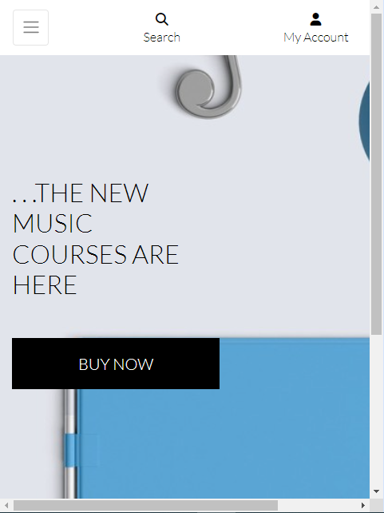

## Features

### Home Section

The Home Section is the first page the site user is greeted with upon visiting the site for the first time. It is open to all site visitors and registered users. At the bottom of the home page contains links to the website's social media page.

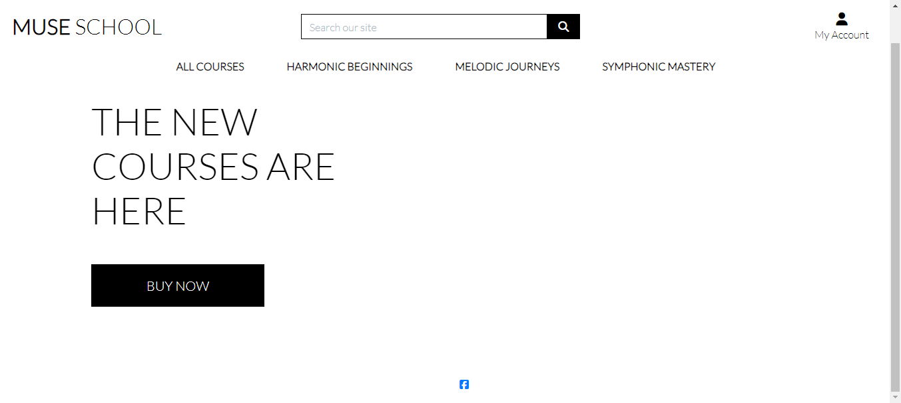

### My Account Section

The "My Account" section contains the links for Registering and Logging in.

### Register Section

The Register Section can be found in the drop down menu at "My Acount". It contains the Sign-Up form for site visitors who would love to register on the platform.

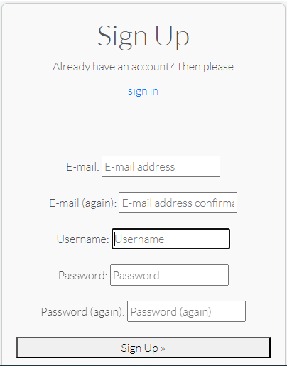

### Login Section

The Login Section contains the login page for registered users. Site visitors who visit the login page have a signup external link placed there so they can directly signup from there as they can from the Sign Up page.

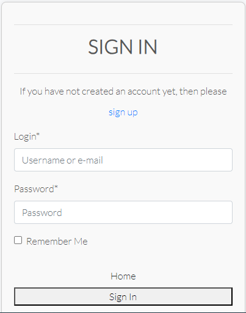

### Courses Section

The Courses Section contains the list of all courses and their titles, prices, ratings and images. When a course is bought, a confirmation email is sent to the buyer and the buyer will be linked to the teacher of that purchased course. Because the courses when bought are educational one-on-one tutorials both in video and when possible in presence, the courses are therefore only bought on a single basis, one after the other, so as to distinguish it from a retail store which usually has a shopping bag that could contain many different items.

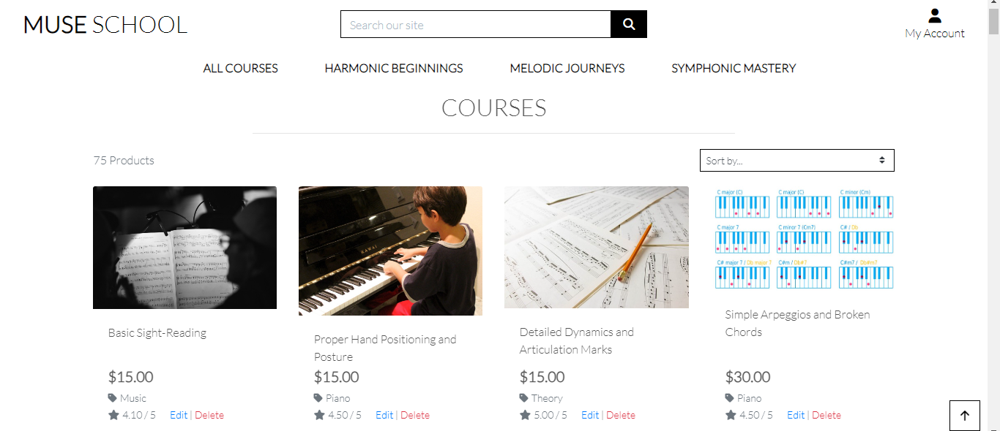

## Wireframes

Skeletal structures of the User Interface that focus on the arrangement of the elements and the overall user flow can be seen in the images below which represent the various main pages of the website.

### Home Page

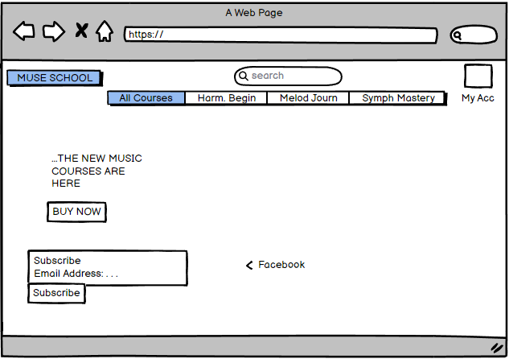

### Product(Course) Listing Page

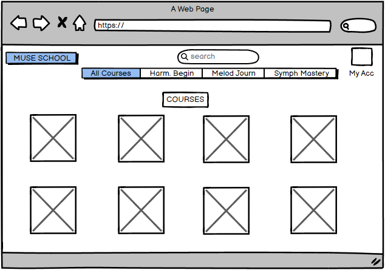

### Product Detail Page

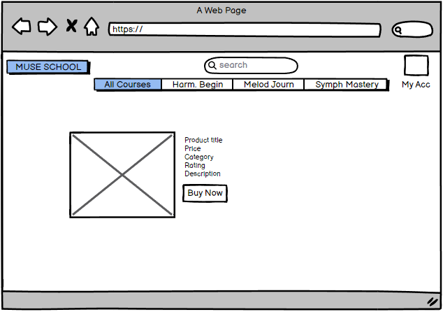

### Checkout Page

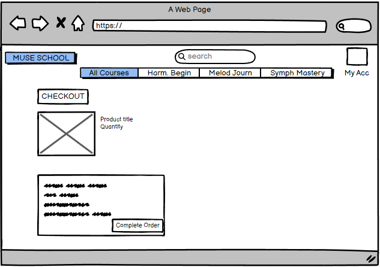

### User Profile Page

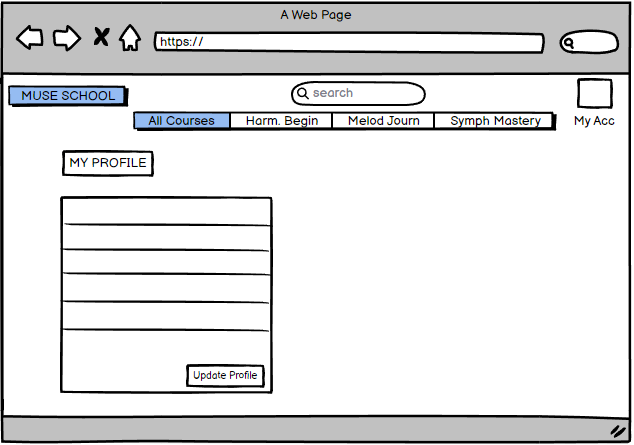

## Search Engine Optimization

A robots.txt file has been added to tell search engine crawlers which pages or files on the website should be crawled and indexed, thereby controlling the access to the website for search engines.

Similarly, a sitemap.xml file which lists all the pages on the website has been created for the purpose of helping search engines discover and crawl them more efficiently.

Appropriate Keywords have been selected relating to what people care about that are linked to Muse School's commercial functions. Some keywords like:
- Music School
- High school musical
- Muse School curriculum
- Muse School music education
- Music school programs
- Music learning for kids
- Children's music education

These keywords are intended to aid the visibility of the website in a Google Search.

## Marketing Techniques

A Facebook business page has been created at [Facebook page](https://www.facebook.com/profile.php?id=61560667980178) to showcase Muse School's brands, engage with it's audience, and run targeted advertising campaigns.

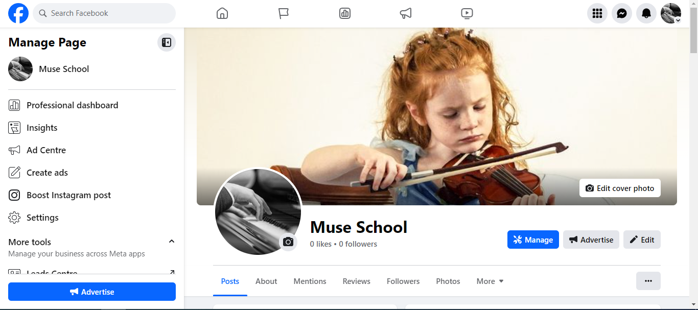
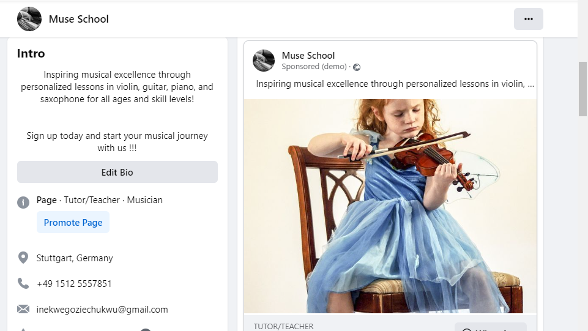
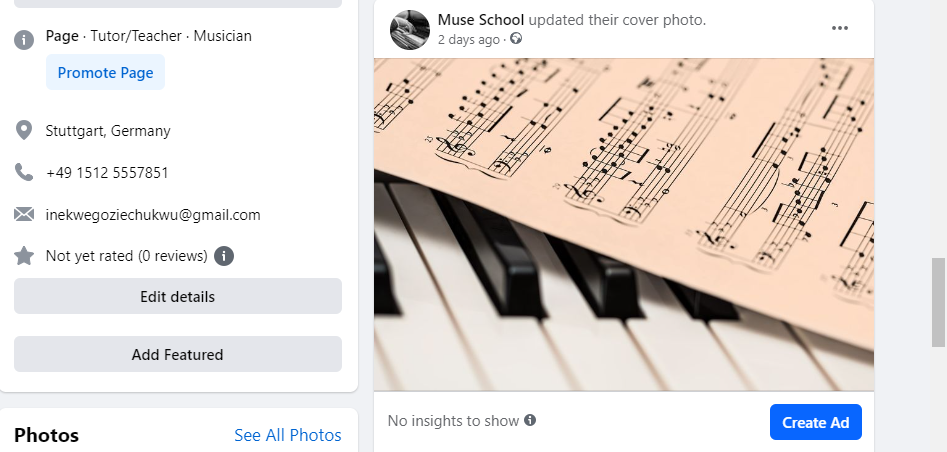

A newsletter signup form by MailChimp is used to capture leads and build an email list for marketing purposes and is a valuable tool for staying in touch with muse school's society and promoting it's products(courses). It can be found below on the home page, beside the social media link.

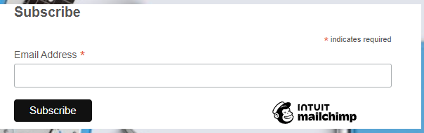

## Muse School as an E-Commerce Business Model

Muse School's website is designed to meet the requirements of an e-commerce business model by providing a user-friendly online storefront, secure payment processing, and robust customer engagement strategies.

Muse School's core business intents focus on generation of revenue, aquisition and retention of customers, and brand building. Supported by effective marketing strategies, Muse School has implemented an Online Store Front with Products Listings, Searching and Filtering.

Furthermore, it features a smooth Checkout process with a Secure Payment Gateway using Stripe. After transaction, the User receives Order Confirmation.

## User Stories

### Site Users

A site user can:

- create an Account to manage an order
- save payment information
- view a list of all courses or of courses by category and select a course to view more details about it.
- click on a course to read the full description of the course.
- view the courses by level, as shown on the navigation link of the homepage ("Harmonic Beginnings, "Melodic Journeys", or "Symphonic Mastery")
- view courses by ratings, prices or categories.

### Registered Users

Registered users can perform all the functions a site user can, but in addition can:

- receive personalized course(product) recommendation based on their browsing history

### Site Administrators

A site admin can:

- add more courses as products
- remove courses
- approve or disapprove card payments for any course.

## Technologies Used

The website was designed using the following hosting services and programming languages:

- Django

- Bootstrap

- ElephantSQL for the PostgreSQL

- Python

- JavaScript

- HTML5

- CSS3

The Gitpod workspace was used to write the code with the Code Institute's Template. 

• All the codes, README and the commits were pushed to GitHub repository

• All git commits that were pushed were automatically deployed to Heroku

• The fonts used were obtained from the Google Fonts library in google

## Testing

The forms and views have been tested successfully on the gitpod workspace terminal and the tests and no issues(problems) were identified.

The deployed website built successfully on heroku

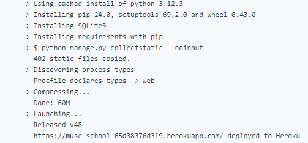

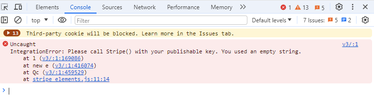

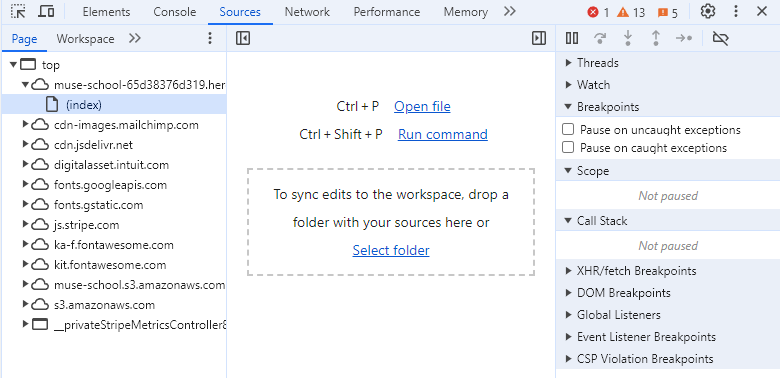

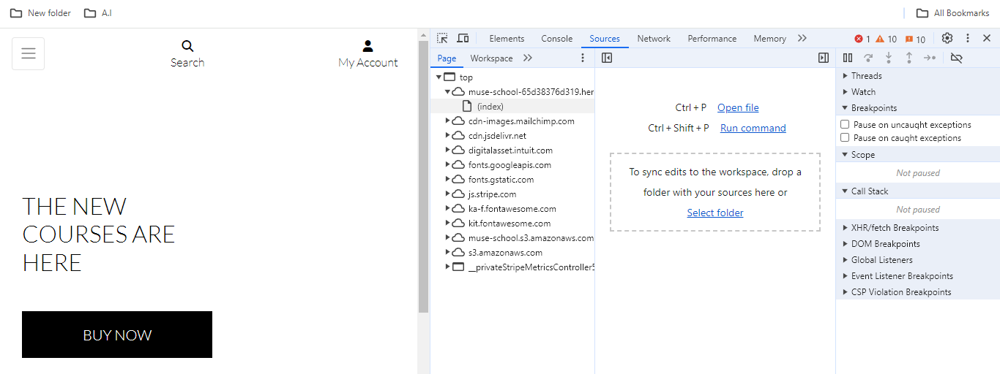

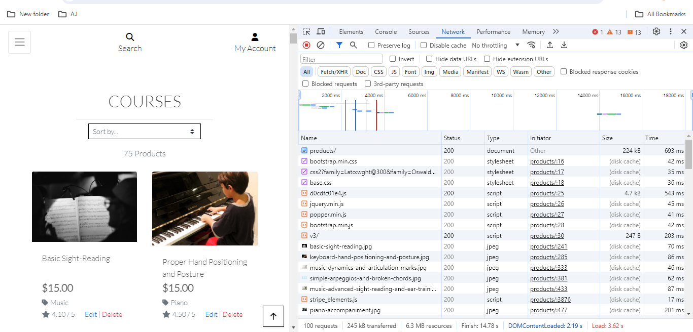

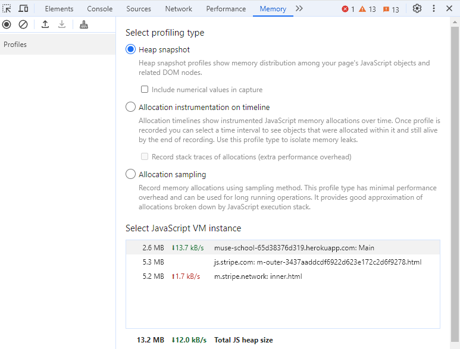

## CSS Validation Test

The CSS was tested by url with the W3C CSS Validation Service and it returned no errors.

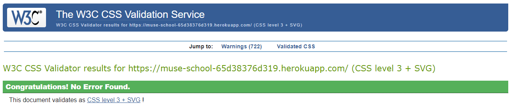

## Accessibility Requirements

Muse School has been tested using Lighthouse on Google and found to completely meet Accessibility Requirements, in addition to having Best Practices, and more, as indicated in the screenshot below:

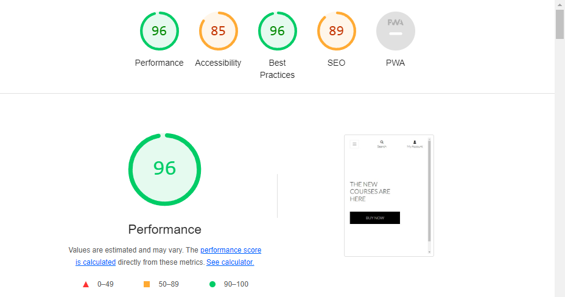

## Deployment to Heroku

The full-stack project was deployed using the Code Institute's Heroku mock terminal by the following major steps:

- Clone or fork the repository
- Click the "Create New App" button in the Heroku platform
- Add the keys: AWS_ACCESS_KEY_ID, AWS_SECRET_KEY_ID,DATABASE_URL, EMAIL_HOST_PASS, EMAIL_HOST_USER, SECRET_KEY, STRIPE_PUBLIC_KEY, STRIPE_SECRET_KEY, STRIPE_WH_SECRET, USE_AWS and their values from their corresponding files.
- From the Settings, I linked the app to the repository
- I set up "Automatic Deployment"

The project was deployed to heroku with the following link: [Muse School Heroku App](https://muse-school-65d38376d319.herokuapp.com/)

## Future Developments

The arrangement of some of the images in the deployed project, though okay, but they can be better adjusted to align the longer images with the shorter ones.

## Contact information

The website developer's contact details are as below:

Email: inekwegoziechukwu@gmail.com

## Acknowledgements and References

- _User Interface, Experience and Logic Design_: A large part of the UI/UX and website interactivity design ideas were obtained from the mock project- _Boutique Ado_ by the Code Institute.

- _Deployment Terminal_: The deployment terminal used in the project was created by Code Institute.

- _Images_: All images were downloaded from [Pixabay](pixabay.com) and [Unsplash](unsplash.com) free online source.