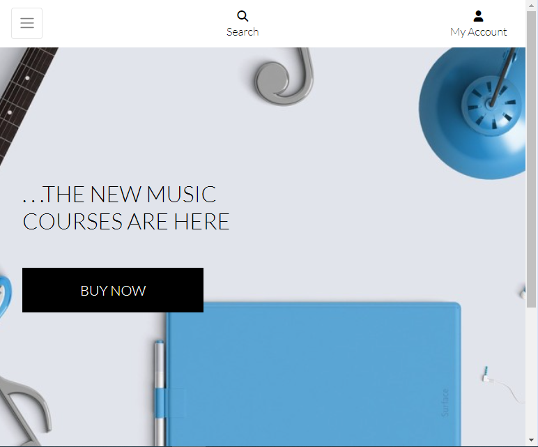
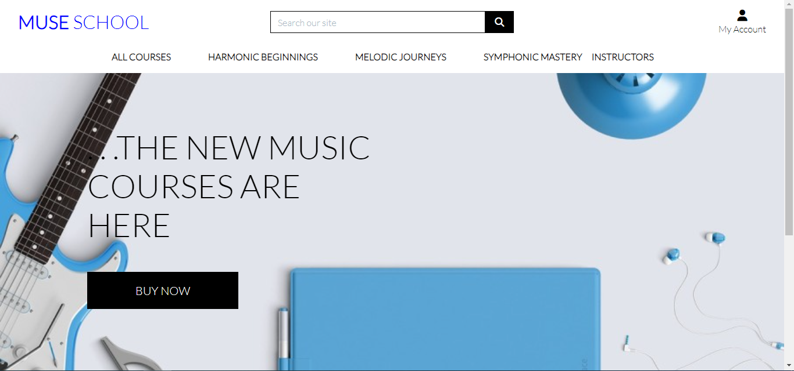

# Muse School

Muse School is a django-based eCommerce site which runs in the Code Institute mock terminal on Heroku. It seeks to aid people in learning music theory and musical instruments, specifically the violin, the saxophone, the piano and the guitar in a progressive step-by-step basis from beginner to mastery. The site will be targeted towards all kinds of people who have interest in learning music, but especially towards passionate learners who have the patience to go through the simplified lesson categories. The lessons in this eCommerce site can be bought by the user in the form of products in an eCommerce website. 

## Using Muse School

Upon visiting Muse School's website, the user will be greeted with the homepage which contains the navigation links and a clickable button to begin the first page of the collected stories. The user can freely click on any feature or story to discover its content in detail. This blog site is responsive to all device sizes and works effectively on all types of browsers.

## Features

### Home Section

The Home Section is the first page the site user is greeted with upon visiting the site for the first time. It is open to all site visitors and registered users. The stories are displayed on the Home page. At the bottom of the home page contains the blow owner's name and links to the blog owner's social media accounts.

### About Section

The About Section contains information about the blog owner and the motivation for creating the website. The About Section also contains a "Let's collaborate" subsection which is for individuals who have a project in mind, wish to co-author an article, or simply want to brainstorm some ideas.

### Register Section

The Register Section contains the Sign-Up form for site visitors who would love to register on the platform. Registered users can both read posts and comment on a post, but site visitors can only read posts and comments.

### Login Section

The Login Section contains the login page for registered users. Site visitors who visit the login page have a signup external link placed there so they can directly signup from there as they can from the Sign Up page.

## Wireframes

The skeletal structure of the User Interface that focus on the arrangement of the elements and the overall user flow can be seen in the image below:

## Technologies Used

The website was designed using the following hosting services and programming languages:

- Django

- Cloudinary (for external image management)

- ElephantSQL for the PostgreSQL

- Python

- JavaScript

- HTML5

- CSS3

- [Google Fonts](https://fonts.google.com/) was used to obtain the two fonts, Lato and Sans-Serif used in the website.

The Codeanywhere workspace was used to write the code. 

• All the codes, README and the commits were pushed to GitHub repository

• The fonts used were obtained from the Google Fonts library in google

## Validation Testing

The author has tested the website's user interface and has found out that it looks the same on the browsers- Google Chrome, Mozilla Firefox and Microsoft.

- The HTML codes have been tested using validation by url in the w3C HTML Validator and no errors were returned.

- The Python code for the blog views have also been tested and returned no errors.

## Testing Forms and Views

The forms and views have been tested on the codeanywhere workspace terminal and the tests, totalling to 10 tests returned successful.

## Accessibility Requirements

MindBodyHealth has been tested using Lighthouse on Google and found to completely meet Accessibility Requirements, in addition to having Best Practices, and more, as indicated in the screenshot below:

## Deployment to Heroku

The full-stack project was deployed using the Code Institute's Heroku mock terminal by the following major steps:

- Clone or fork the repository
- Click the "Create New App" button in the Heroku platform
- Add the keys: CLOUDINARY_URL, DATABASE_URL, and their values from their corresponding files.
- I also added a SECRET_KEY and created a private value for it
- From the Settings, I linked the app to the repository
- Click on the "Deploy" button

The project was deployed to heroku with the following link: [MindBodyHealth Heroku App](https://mind-body-health-1a3a657f9bb9.herokuapp.com/)

## User Stories

### Site Users

A site user can:

- view a paginated list of posts to select which post to view.
- click on a post to read the full text.
- view comments on individual posts to read the conversation.
- register an account so as to be able to comment on a post.
- like or unlike a post, so as to appreciate the writer.

### Registered Users

A registered user can:

- leave comments on a post in order to be involved in the conversation.
- modify or delete his or her comment on a post so as to be involved in the conversation.
- create, read, update and delete posts so as to manage his or her blog content.
- create draft posts in order to finish writing the content later.

### Site Administrators

A site admin can:

- approve or disapprove comments in order to filter out objectionable comments.
- create or update the About page so that it is available on the site.

## Bugs, and How I Fixed Them

I discovered my "Edit" button for posted comments was not responding to the click event, in order to fix this, I checked the button id on the post html and the button id on the comment section JavaScript and found that I had used the wrong button id on the post html. I then changed the button id for the "Edit" button on the post html to correspond with the button id for the edit-event listening function in the comment section javascript. This solved the issue.

Secondly I discovered that when comments have not been approved yet by the admin, they were visible in blur form to not only the maker of the comment, but to other registered users. To fix this, I placed the comment-form variable definition above the post-request condition in the blog views python file. This action solved the issue.

## Contact information

The website developer's contact details are as below:

Email: inekwegoziechukwu@gmail.com

## Acknowledgements and References

- _Blog Post Content_: The contents of the blog posts are real life stories of individuals, extracted from the blog owner's personal testimony and from the book titled "The 5 Resets" written by the Harvard stress expert, Dr. Nerurkar Aditi.

- _User Interface, Experience and Logic Design_: A large part of the UI/UX and website interactivity design ideas were obtained from the mock project- _Codestar blog_ by the Code Institute.

- _Deployment Terminal_: The deployment terminal used in the project was created by Code Institute.

- _Images_: All images were downloaded from [Pixabay](pixabay.com) free online source, except the image in the About Section of the blog site, which was downloaded from the mock project- _Codestar blog_ by the Code Institute.